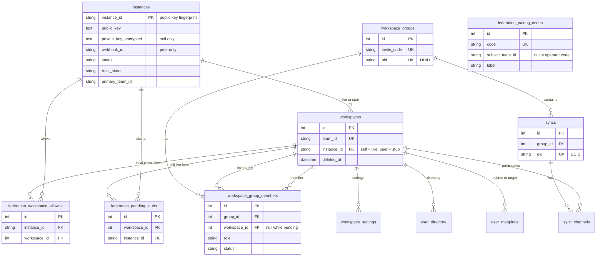
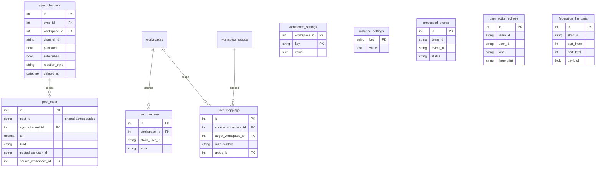
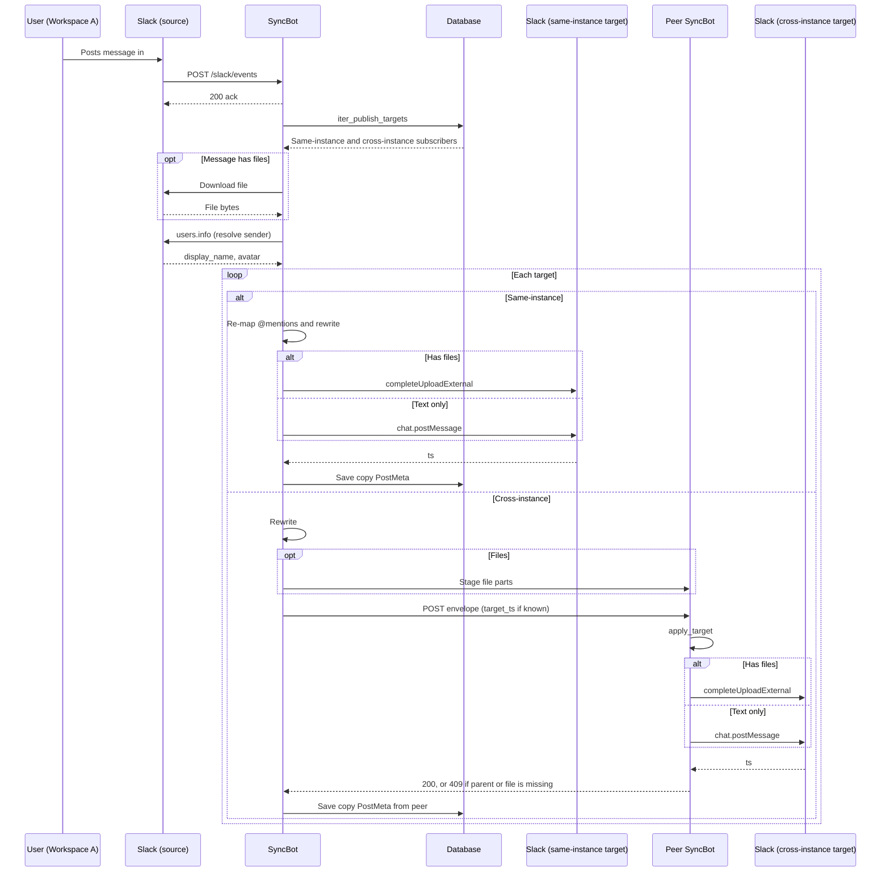
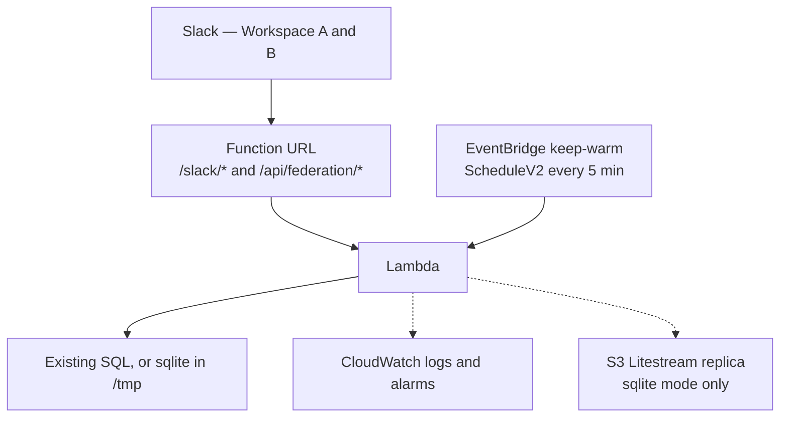
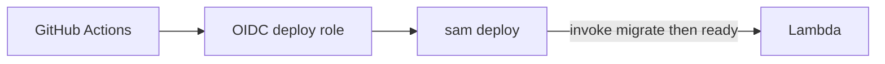
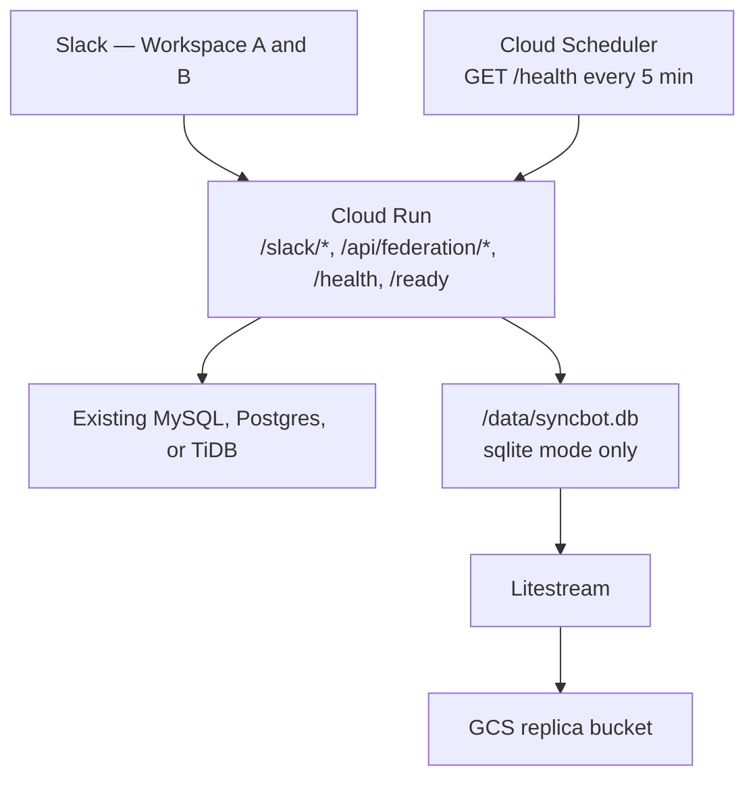
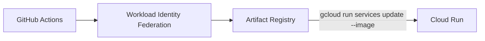

# Architecture

This page is how SyncBot is put together: the Python packages, the **relational schema**, the message-sync path, and the reference AWS and GCP layouts. For how to deploy, see [DEPLOY.md](DEPLOY.md).

## Module Overview

SyncBot is organized into six top-level packages inside `syncbot/`:

| Package | Responsibility |
|---------|----------------|
| `handlers/` | Slack event and action handlers (messages, groups, channel sync, users, tokens, federation UI, backup/restore, data migration) |
| `builders/` | Slack UI construction — Home tab, modals, and forms |
| `helpers/` | Business logic, Slack API wrappers, sync envelope/pipeline, PostMeta lookups, encryption, file handling, user mapping, caching, export/import (backup dump/restore, migration build/import) |
| `federation/` | Cross-instance sync — Ed25519 signing/verification, HTTP client, API endpoint handlers, pair/teams payloads, stub heal (opt-in) |
| `db/` | SQLAlchemy engine, session management, `DbManager` CRUD helper, ORM models |
| `slack/` | Block Kit abstractions — action/callback ID constants, form definitions, ORM elements |

Top-level modules: `app.py` (entry point), `routing.py` (event dispatcher), `constants.py` (env-var names), `logger.py` (structured logging + metrics).

## Database schema

Models are in [`syncbot/db/schemas.py`](../syncbot/db/schemas.py). Bolt OAuth tables (`slack_bots`, `slack_installations`, `slack_oauth_states`) are not ORM classes. There is **no `ON DELETE CASCADE`**. Soft-deleted rows use `deleted_at`; active queries must filter `deleted_at IS NULL`. Hard deletes go through `purge_sync` / `purge_workspace` (children first).

`DbManager.get_record` uses each model's `get_id()` column, which is **not always the integer primary key**. `Workspace` is looked up by Slack `team_id`. `PostMeta` is looked up by `post_id` (several rows can share one `post_id`). `SyncChannel` uses the integer `id`.

Natural keys that matter across instances: Slack `team_id` and `channel_id`; this install's Ed25519 **public-key** fingerprint (`instances.instance_id`, 64 hex characters); `workspace_groups.uid` and `syncs.uid` (UUIDs for replication). Integer PKs stay local to this database.

### How to read the map

A **Slack team** is one `workspaces` row. Unique `team_id` means this install never stores the same Slack team twice. **Live vs stub** is `workspaces.instance_id`: live when it equals this install's fingerprint; stub when it equals a peer fingerprint. Token presence is not the kind check — bot tokens live in Bolt `slack_bots` and are looked up with `helpers.workspace.get_bot_token`. Group members and sync channels always FK `workspaces.id`, so inviting a remote team looks like inviting a local one.

A **SyncBot install** (this one or a peer) is one `instances` row. The self row has `private_key_encrypted` and a null `webhook_url`. Peer rows have a webhook and no private key. Several stubs can share one peer fingerprint.

A **group** is a named set of workspaces. A **sync** is a named channel relationship inside a group. Membership of a Slack channel in a sync is `sync_channels`. Each copy of a message (or a Hybrid reaction notice) is `post_meta` on one `sync_channel`.

### Entity-relationship overview

Core identity and federation:



Sync copies, people, policy, and ephemeral rows:



Bolt OAuth (not in `schemas.py`) keys off Slack `team_id` / `user_id` strings, not `workspaces.id`. Bot API calls use `get_bot_token` → `slack_bots` (then local `SLACK_BOT_TOKEN` when OAuth is off). User tokens stay in `slack_installations`.

### Table reference

**This install and peers**

| Table | Role |
|-------|------|
| `instances` | Self and peer SyncBot installs. PK `instance_id` is the SHA-256 hex fingerprint of the Ed25519 public key (64 characters). Self has `private_key_encrypted` (Fernet) and null `webhook_url`. Peers have `webhook_url` and no private key. `trust_status` is `trusted` or `untrusted`. Leftover `SYNCBOT_INSTANCE_ID` is ignored. The keypair is minted on boot even when federation is off. |
| `instance_settings` | Operator policy as key/value (`federation_enabled`, soft-delete retention). Not secrets. |

**Slack teams on this database**

| Table | Role |
|-------|------|
| `workspaces` | One row per Slack `team_id`. `instance_id` is this install (live) or a peer (stub). Soft-deletable. Integer `id` is the FK used everywhere else. |
| `workspace_settings` | Composite PK `(workspace_id, key)`. Private-channel policy, extra managers, last Auto Map timestamp. |

**Peer installs (External Connections)**

| Table | Role |
|-------|------|
| `federation_pairing_codes` | Pairing-only `FED-` codes. They do not create a group. `subject_team_id` null = operator External Connections code; set = workspace-scoped migration code. Both kinds appear as waiting External Connections until consumed or expired. `allowed_workspace_ids` is the creator's local allowlist (JSON), applied when the peer pairs; it is not in the signed blob. The blob signs the primary Team ID; the primary Workspace name is display-only. Consumed on successful pair, including URL heal. |
| `federation_pairing_requests` | Leaving-workspace admin asked primary admins for a pairing code. At most one pending row per subject team. |
| `federation_pending_stubs` | Peer claimed a team that is still live here. Convert to stub after uninstall (not while live). Unique `(workspace_id, instance_id)`. |
| `federation_workspace_allowlist` | Which **local** workspaces this peer may see. Unique `(instance_id, workspace_id)`. If empty, shared groups decide the allowed set. Heal of an existing member ignores the allowlist. |
| `federation_file_parts` | In-flight file mailbox. Unique `(sha256, part_index)`. TTL in application code (~5 minutes). `part_total` is the sender's part count. Payload is Fernet-encrypted with `DATA_ENCRYPTION_KEY` when encryption is on. Omitted from full-instance backup and workspace migration export. |

**Groups and syncs**

| Table | Role |
|-------|------|
| `workspace_groups` | Named group. Local `invite_code` (`GRP-…`) is unique on this install. `uid` is a required UUID string (36 chars) for replication. |
| `workspace_group_members` | `(group_id, workspace_id)`. `workspace_id` may be null on a **pending** invite. `role` is `owner` or `member` (`admin` is reserved and never written). Uninstall retains the owner row; remaining members see the group with no owner until retention ends. After retention purge, the earliest remaining local member is promoted or the group is disbanded. `PRIMARY_WORKSPACE` is not auto-added. Remote teams are stub `workspaces` rows; this table does not store a peer FK. |
| `syncs` | Named sync in a group (`group_id`). `sync_mode` is typically `group`. `uid` same pattern as groups. Fan-out uses `sync_channels.publishes` / `subscribes` only (no leftover publisher/target columns). |
| `sync_channels` | One Slack channel's membership in one sync. A channel may appear in several syncs (fan-in). `publishes` / `subscribes` are independent. `reaction_style` is Hybrid / Direct / Off. `channel_name` is the Slack display name (replicated so stub Home can show `#name` without a bot token). Pause sets `status`; Leave soft-deletes or purges. |

**Message copies and people**

| Table | Role |
|-------|------|
| `post_meta` | One row per copy (or Hybrid notice) on a `sync_channel`. Shared `post_id` ties origin and copies. `ts` is `DECIMAL(16,6)` — write and compare with `post_meta_ts()`, never `float`. `kind` distinguishes messages vs reaction notices. `posted_as_user_id` is the target user token that created the copy. `source_workspace_id` FKs `workspaces.id`. |
| `user_directory` | Cached profiles per workspace (`slack_user_id`, email, names). Unique `(workspace_id, slack_user_id)`. Used for Auto Map and on-the-fly author map. |
| `user_mappings` | Map from `(source_workspace_id, source_user_id)` to `target_user_id` (nullable for explicit no-map). Optional `group_id`. |

**Ephemeral (omitted from full-instance backup)**

| Table | Role |
|-------|------|
| `processed_events` | Slack Events API claim on `(team_id, event_id)`. |
| `user_action_echoes` | User-token write fingerprints so inbound echoes skip. Unique `(team_id, user_id, kind, fingerprint)`. |
| `federation_file_parts` | See above. |
| `slack_oauth_states` | Bolt OAuth CSRF state. |

**Bolt OAuth (tokens at rest)**

| Table | Role |
|-------|------|
| `slack_bots` | Workspace bot installation (encrypted `bot_token` when encryption is on). Canonical bot-token store after migration 016. |
| `slack_installations` | Per-user Authorize rows (`user_id` + `user_token`). |

### Invariants

1. **One Slack team, one row.** Live install and stub cannot share a `team_id`. Live vs stub is `instance_id`, not token presence.
2. **Heal both ways.**
   - While a matching team is still live here, a peer claim records `federation_pending_stubs` and DMs admins once. Inbound federation for that live target is dropped.
   - Uninstall or Leave Connection pauses the row for the retention window (PostMeta stays).
   - After uninstall, a pending claim converts the row to a stub for the trusted peer.
   - Reinstalling SyncBot on that team, or importing that Workspace's migration file here, converts a stub or paused row back to a live install. Public synced Channels are rejoined and resumed; private ones stay paused until Resume Sync.
   - Reconnecting an External Connection unpauses that peer's stubs.
3. **Delivery.** Same-instance (live) → `apply_target` (bot token from `get_bot_token`). Cross-instance (trusted peer) → `deliver_remote`.
4. **Group/sync uuids are not Slack ids.** They exist so a peer can upsert “the same group/sync” without this database’s integer PKs.
5. **Channels stay Slack-keyed.** Replication of a channel is `(sync uid, team_id, channel_id)`, not a uuid on `sync_channels`.
6. **Untrusted peer.** `trust_status = untrusted` plus paused stub `sync_channels`. Inbound federation HTTP is **401** once the `SyncBot-Federation` User-Agent is present. URL heal updates `webhook_url` only and does not re-trust. Home **Verify Trust** is how an admin re-trusts after confirming the peer's name, URL, fingerprint, and remote Workspaces.

## Message Sync Flow

SyncBot builds one source-canonical envelope and sends it through [`run_sync_pipeline`](../syncbot/helpers/sync_pipeline.py#L26). `kind` is `message` or `reaction`. Message actions are `create`, `edit`, or `delete`. Reaction actions are `add` or `remove`. Keys that do not apply are omitted rather than sent empty.

**Same-instance** means the target workspace is live on this install ([`is_local_workspace`](../syncbot/helpers/workspace_kind.py#L55)). **Cross-instance** means the Channel belongs to a workspace on a peer install ([`is_stub_workspace`](../syncbot/helpers/workspace_kind.py#L68)). That workspace is still a stub row in the database; the pipeline talks to the peer instead of posting with a local bot token.

1. Slack POSTs `/slack/events`. Bolt matches every event in [`app.py`](../syncbot/app.py#L403-L404). [`main_response`](../syncbot/app.py#L334) acks Slack, then [`MAIN_MAPPER`](../syncbot/routing.py#L120-L124) sends `message` to [`respond_to_message_event`](../syncbot/handlers/message.py#L517) and `reaction_added` / `reaction_removed` to [`handle_reaction`](../syncbot/handlers/reaction_event.py#L54). [`run_claimed`](../syncbot/db/event_claims.py#L129) claims Slack `event_id` + `team_id` so a retry does not double-apply.
2. The handler builds one envelope with [`build_envelope`](../syncbot/helpers/envelope.py#L35) (people, source channel and workspace, body, optional files) and builds origin PostMeta with [`build_origin_post_meta_rows`](../syncbot/helpers/post_meta.py#L135). A new top-level post does that in [`_handle_new_post`](../syncbot/handlers/message.py#L200). A thread reply is [`_handle_thread_reply`](../syncbot/handlers/message.py#L275). A reaction is [`_sync_reaction_records`](../syncbot/handlers/reaction_event.py#L12). Origin rows are persisted after the pipeline returns. A same-instance copy is persisted inside `apply_target`. A cross-instance copy on this install is saved from the peer response.
3. [`run_sync_pipeline`](../syncbot/helpers/sync_pipeline.py#L26) calls [`iter_publish_targets`](../syncbot/helpers/sync_participation.py#L153). That finds every subscribing Channel in syncs where the origin publishes, and deduplicates by workspace and channel.
4. A top-level create keeps every publish target. A thread create (and a file in a thread) goes same-instance only to Channels that already have the parent PostMeta ([`is_thread_create`](../syncbot/helpers/sync_pipeline.py#L54-L65)). Trusted cross-instance Channels still get that envelope; the peer returns 409 if it has no parent.
5. Same-instance targets run [`apply_target`](../syncbot/helpers/sync_apply.py#L41) in the [local loop](../syncbot/helpers/sync_pipeline.py#L148-L161). Cross-instance targets run [`deliver_remote`](../syncbot/federation/deliver.py#L245) in the [peer loop](../syncbot/helpers/sync_pipeline.py#L170-L200): [`stage_unique_files_for_peer`](../syncbot/federation/deliver.py#L348) first, then the envelope. Origin puts that Channel's Slack ts on the envelope as `target_ts` when it already has the copy row. [`build_remote_envelope`](../syncbot/federation/deliver.py#L64) adds `channel_id` and drops local integer ids.
6. On the peer, [`handle_message`](../syncbot/federation/api.py#L1014) applies an inbound create. Replies use [`_inbound_thread_ts`](../syncbot/federation/api.py#L139) (`target_ts`, or PostMeta on the resolved SyncChannel). Inbound edits, deletes, and reactions ([`handle_message_edit`](../syncbot/federation/api.py#L1114), [`handle_message_delete`](../syncbot/federation/api.py#L1172), [`handle_message_react`](../syncbot/federation/api.py#L1229)) need that PostMeta row. Missing parent is 409 `parent_missing` ([`_parent_missing`](../syncbot/federation/api.py#L157)). Missing file parts are 409 `incomplete_file`. A complete part set that does not assemble is 409 `assemble_failed` ([materialize loop](../syncbot/federation/api.py#L1060-L1080)).
7. The copy's inbound create is skipped in [`respond_to_message_event`](../syncbot/handlers/message.py#L618-L657) (user-token echo and copy PostMeta). Follow-ups on a publishing Channel still fan out on that message's shared `post_id`. There is no second hop: [`iter_publish_targets`](../syncbot/helpers/sync_participation.py#L158) does not walk the target Channel's other groups.

A thread reply in Workspace A `#general` from Ada Lovelace looks like this before fan-out. Edits, deletes, and reactions use that message `post_id` and do not carry `thread_post_id`. Federation outbound adds `channel_id` and `target_ts`, and drops local integer ids (`source_workspace_id`, `source_sync_channel_id`, `mapped_user_id`).

```json
{
  "kind": "message",
  "action": "create",
  "post_id": "a1b2c3d4e5f64789a0b1c2d3e4f50617",
  "thread_post_id": "9f8e7d6c5b4a3210fedcba0987654321",
  "source_channel_id": "C0GENERAL01",
  "source_workspace_id": 1,
  "source_team_id": "T0WORKSPACEA",
  "source_sync_channel_id": 12,
  "people": [
    {
      "user_id": "U0ADA",
      "name": "Ada Lovelace",
      "avatar_url": "https://example.com/ada.png"
    }
  ],
  "text": "Hello from Workspace A",
  "blocks": [{ "type": "rich_text", "elements": [] }],
  "file_refs": [
    {
      "sha256": "aaaaaaaaaaaaaaaaaaaaaaaaaaaaaaaaaaaaaaaaaaaaaaaaaaaaaaaaaaaaaaaa",
      "name": "notes.pdf",
      "mimetype": "application/pdf",
      "size": 2048
    }
  ],
  "source_user_id": "U0ADA",
  "user_name": "Ada Lovelace",
  "user_avatar_url": "https://example.com/ada.png",
  "workspace_name": "Workspace A",
  "source_ts": "1730000000.000100"
}
```

Public GIF URLs travel as `images` (`url`, `alt_text`) instead of `file_refs`. A reaction envelope is `kind` `reaction`, `action` `add` or `remove`, plus `reaction` and `event_ts` (last-write-wins).



Each `SyncChannel` records `publishes` and `subscribes` independently. An inbound Slack event may originate only from a publishing Channel, and the pipeline applies it only to subscribing targets.

- A Channel may be published in more than one group.
- Fan-in is allowed: one local Channel may subscribe to several different published sources, but not to the same source twice.

The same envelope path applies to edits (`chat.update`), deletes (`chat.delete`), thread replies (with `thread_ts` on the parent PostMeta records only), files, and reactions. Target message and file writes prefer the mapped person's user token and fall back to bot customization. `post_meta.posted_as_user_id` records which user token created a target post, so later edits and deletes use the same actor.

**Files**

- A file share is one native upload for both tokens. The file is the message. Bot posts set the same from line as other messages. Block Kit and a public GIF go on that upload; plain text is the upload comment. A file with no text is just the file.
- File ids are remembered before the file is shared into the Channel. The copy's `post_meta` row is written when that target write returns, so an inbound `file_share` is not treated as a new origin.
- When `files.completeUploadExternal` and the first `files.info` omit `shares` (common for bot-token file-only posts), SyncBot retries channel history. If the ts is still missing, it records the ts from the inbound own-bot or user-token `file_share`.
- Slack `upload` is ignored (share-at-upload-time vs later). A `file_share` is a share.
- A text reply that lists the parent's files is identified by Slack fields (`thread_ts` differs from `ts`; subtype is not `file_share`; has text). Those files are ignored and the reply is synced. Also-send-to-channel (`thread_broadcast` / `reply_broadcast`) keeps its files.
- A new file in a thread arrives as `subtype=file_share`, or as a file-only thread message when Slack omits the subtype.
- Slack-hosted `video` / `image` Block Kit URLs (`files.slack.com`) are not copied; the file bytes still go through `files[]` and `file_refs`.
- Free-plan files may be `hidden_by_limit` (no private URL). Target upload may return `storage_limit_reached`. Those shares fail and DM the source author.

**Reactions**

- A target with reaction type Off still receives the reaction envelope and skips apply for add and remove.
- Reactions use the mapped person's target-workspace user token when possible. Hybrid falls back to a bot thread notice only when that person has not authorized or their target token is invalid.
- Before that notice, SyncBot probes the target emoji name with the bot token when the target is in another Slack workspace (same-instance cross-workspace or federation inbound). Same-workspace targets skip the probe because they share an emoji catalog. Direct-only, Off, and a successful native add never probe.
- On Hybrid and Direct targets, unreact removes native reactions and deletes matching Hybrid notices (children first) via deterministic `rxn-` `post_id` rows in `post_meta` (`kind`, `parent_post_id`, `reaction`, `source_user_id`, `source_workspace_id`). A user deleting a notice on one target is a local tombstone only.
- Native reactions SyncBot applied with a user token emit a normal `reaction_added` / `reaction_removed` as that person. Those echoes are remembered in `user_action_echoes` and skipped inside `run_claimed` before fan-out.

**Claims and retries**

Slack delivers Events API payloads **at least once**. Message and reaction handlers claim Slack envelope `event_id` + `team_id` in `processed_events` before side effects.

- A duplicate delivery is a no-op. A failed attempt releases the claim so the retry can recover.
- Work that is not ready yet (for example a reaction whose source PostMeta row is not written yet) also releases the claim. If a reply, edit, delete, or reaction arrives before the parent PostMeta row exists, the claim is released so Slack can retry.
- Envelopes that will never sync complete the claim as a no-op so Slack stops retrying them: SyncBot's own posts, a top-level plain message that is waiting for `file_share` because the files are not downloadable yet, and unsynced subtypes.
- Local fixtures that omit `event_id` are processed without claiming.

User-token echo rows are separate from envelope `event_id`.

- Reaction echoes are consumed when the matching inbound event is skipped.
- File-id echo matches kept-file inbound events (the share SyncBot just posted).
- Message-ts echo and copy `post_meta` skip the inbound create of that copy.

At `LOG_LEVEL=DEBUG`, skip and fan-out steps emit structured `log_debug()` events (message skip, missing parent, pipeline with no targets, file share ts, stub heal, inbound federation skip, missing bot token, and `/teams`). Pair success and migration export/import use `log_info()`.

**Message body**

Message bodies are taken from Block Kit when present. Slack `event.text` is a notification fallback: long app posts often arrive with newlines flattened to spaces and a truncated tail. The client **Show more** control is chrome on `blocks`, not a second payload.

- SyncBot copies content blocks (`section`, `header`, `rich_text`, and similar), drops `actions` / `input` (those buttons belong to the source app), and skips `file` blocks that only have a source `slack_file` id.
- Link unfurls (Maps, and similar) are not copied as attachments. The target client rebuilds them from URLs in the text.
- Slack pastes a message as `message_mention`. SyncBot converts that to a labeled `link` and keeps the source URL. Unlabeled permalinks get a `message in #channel (Workspace)` label; existing link text is left alone. Target posts set `unfurl_links=false`.
- When a `bot_message` has no usable blocks, SyncBot loads the stored message with `conversations.replies` (parent or in-thread ts).
- Emoji in the body is copied as-is. Target catalog probes are for reactions only.

**Federation**

The receiving instance applies the inbound envelope only when the addressed local channel subscribes.

- Source `#channel` mentions and permalinks are rewritten on the origin (the peer cannot look up source Slack) into a code-ticked `#name (Workspace)`, never a target twin `<#C>`.
- Inbound remaps `@` mentions from User Mapping, User Directory, and envelope `people` names.
- File bytes travel as hashed parts. Apply still uses the same upload path as same-instance.
- This instance identifies itself with the SHA-256 hex fingerprint of its Ed25519 public key (64 characters), stored as the self row in `instances`. Leftover `SYNCBOT_INSTANCE_ID` is ignored.
- Inbound federation signs `timestamp + ":" + raw body`. Once the `SyncBot-Federation` User-Agent is present, a missing or malformed header is **400** and a well-formed but untrusted signature is **401**. **404** is for no User-Agent, federation off, an unknown path, an unknown pairing code, or a missing channel/group/sync after a good verify. Pair looks up the pairing code before webhook DNS.
- If a peer claims a team that is still live here, inbound traffic for that live target is dropped until uninstall converts the row to a stub.

## AWS Infrastructure

How to deploy or update this stack (guided script, `sam`, GitHub Actions) is documented in **[DEPLOY.md](DEPLOY.md)**. The diagrams reflect the **reference** SAM template (`infra/aws/template.yaml`) and the optional GitHub Actions path.



The first diagram is the running service. The second is the optional GitHub path; you can still deploy with `./deploy.sh` on your laptop. GitHub cannot create the first bootstrap stack.



All of this AWS layout is defined in `infra/aws/template.yaml` (AWS SAM). **MySQL** is the default: public Lambda talks to a database you already created (TiDB Cloud, MySQL, Postgres, or RDS you own). **Sqlite** uses `/tmp/syncbot.db` plus Litestream to S3, with reserved concurrency 1. The stack does not create RDS or a VPC. Settings live in `instance_settings` and `workspace_settings`. In-flight federation file parts use `federation_file_parts` (omitted from backup).

The Function URL is Slack and federation only (`/slack/*`, `/api/federation/*`). `GET /health` and `GET /ready` are Cloud Run paths; on Lambda those GETs 404 so they do not overwrite the OAuth state cookie.

**Lambda cold start vs Slack acks**

- The main function uses **256 MB** memory and a **120 second** timeout so post-deploy `{"action":"migrate"}` can finish a cold start plus Alembic. Slack's 3s ack is unchanged.
- For **mysql** / **postgresql**, Alembic runs only on that migrate invoke, not on every Slack cold start.
- For **sqlite**, the wrapper restores from S3 and runs Alembic once per execution environment (then `litestream replicate`). A true cold start can miss Slack’s 3s window. Keep-warm (`ENABLE_KEEP_WARM`) makes that rare; events still retry.
- EventBridge keep-warm ScheduleV2 **invokes the Lambda** (`source` `aws.scheduler` / `aws.events`). `app.handler` pulses federation allowlists and a group/sync snapshot, and does **not** republish Home.
- After migrate, the deploy script invokes `{"action":"ready"}`, which pulses again and republishes remembered Home tabs.
- Inbound federation returns 503 if identity or the database is not ready.

## GCP Infrastructure

How to deploy this stack (guided script, Terraform, GitHub Actions) is in **[DEPLOY.md](DEPLOY.md)** and **[infra/gcp/README.md](../infra/gcp/README.md)**. The diagrams match the reference Terraform module in `infra/gcp`. Stage is only `test` or `prod`; the Cloud Run service and image repository follow that stage. The default **`database_backend` is `sqlite`**: Cloud Run keeps one instance (`min_instances=1`) with a local SQLite file and a Litestream replica in GCS. Set `GCP_CLOUD_RUN_MIN_INSTANCES=0` to scale to zero. **`mysql`** or **`postgresql`** is TiDB Cloud or other SQL (no GCS bucket). Cloud SQL is not created.



The first diagram is the running service. The second is the optional image-only GitHub path; Terraform still stays on your laptop.



- GitHub Actions never runs `terraform apply`. Image updates are CI-only. Terraform `lifecycle.ignore_changes` keeps the container image from being overwritten on later applies.
- Sqlite forces `max_instances=1` and concurrency 1.
- Keep-warm uses request-based billing (`cpu_idle=true`) with an OIDC Cloud Scheduler **`GET /health`** (allowlist pulse only; not Home republish). The app finishes Slack listener work before the HTTP response, because CPU is throttled once that response is sent. The Lambda adapter acks first and re-invokes.
- After a deploy, the script waits for `/health` and then **`GET /ready`**, which pulses again and republishes remembered Home tabs.
- The default `min_instances=1` meets Slack's 3s budget. Scale-to-zero (`min_instances=0`) relies on Slack retries; sync handlers are idempotent on `event_id`.
- Inbound federation returns 503 if identity or the database is not ready.

## Security & Hardening

| Layer | Protection |
|-------|------------|
| **Network** | TLS to the existing SQL host when used, public HTTPS origin, federation Ed25519 signing with 5-minute replay window |
| **Database** | `pool_pre_ping=True` for stale connection detection, retry decorator on all operations, `dispose()` only after all retries exhausted |
| **Encryption** | Bot and user OAuth tokens encrypted at rest with Fernet (PBKDF2-derived key, cached to avoid repeated 600K iterations). Bolt `slack_installations` / `slack_bots` use `EncryptedSQLAlchemyInstallationStore`; compare decrypted plaintext when refreshing bot tokens — never compare two Fernet ciphertexts. |
| **Downloads** | Streaming, Slack's 1 GB per-file limit, 8 KB chunks. The platform request timeout ends a transfer still in progress. In-flight federation file-part payloads use the same `DATA_ENCRYPTION_KEY`; they are omitted from backup and migration export. |
| **Slack API** | `slack_retry` decorator with exponential backoff, `Retry-After` header support, user profile caching |
| **Input** | Platform receive cap for federation JSON and Slack Events POST, `_sanitize_text` on form input |
| **Authorization** | Slack admins and owners open Settings, Backup, Reset, and External Connections. Extra managers (per-workspace Settings) can configure groups and syncs. Instance Settings, backup, reset, and External Connections are also gated by `PRIMARY_WORKSPACE`. Home and Authorize are open to everyone. Authorize stores that person's own user token for private-channel invite and target writes as them; never another member's token, and never on federation payloads. OAuth starts only at this instance's `/slack/install`. |

## Performance & Cost (Home and User Mapping)

To keep database and Slack API usage low on Home and User Mapping:

- **Home content hash** — A minimal set of DB queries computes a hash of the data that drives Home (groups and their names, members, syncs and their titles, pending invites, External Connections — peers, allowlists, remote stubs, waiting codes — and whether that person has authorized SyncBot). If the hash matches the last full refresh, the app skips expensive work. Completing OAuth also publishes Home for that user (same `views.publish` path as a successful Refresh). For non-managers the hash is only that authorize payload, not groups and syncs, so a member clicking **Refresh** does not rebuild the whole workspace.
- **Cached Home blocks** — After a full refresh, the built Block Kit payload is cached under `home_tab_hash:{team_id}:{user_id}` / `home_tab_blocks:{team_id}:{user_id}`. When the hash matches, the app re-publishes that cached view with one `views.publish` instead of re-running all DB and Slack calls.
- **60-second Home cooldown** — If the user clicks Refresh again within 60 seconds and the hash is unchanged, the app re-publishes the cached view with a message: "No new data. Wait __ seconds before refreshing again."
- **Home push is acting user + invalidation** — `refresh_home_tab_for_workspace` invalidates the Home hash/blocks prefix for that Slack workspace, then (when `user_id` is set) publishes Home for that person only.
  - It does **not** call `get_admin_ids` / `users.list` to fan out to every admin.
  - Other people rebuild on the next `app_home_opened` or their own Refresh.
  - Partner workspaces in the same group are invalidate-only unless the handler has a user on that workspace.
  - Inbound federation is invalidate-only (no `views.publish`). `/teams` pauses this peer's stubs that left the allowlist.
- **Button modals** — The ack opens a close-only Loading view, with no database read and no `users.info`. The work phase fills that view. Edit Mapping is the only push. If the handler does not fill the view, it becomes a close-only denial. A failed open does not DM the user.
- **User Mapping is a modal** — The work phase fills the Loading view from the current DB mapping list. There is no seed, map, or directory crawl on open. Mapping never replaces the Home tab with `views.publish`.
  - Slack caps modals at 100 blocks, so the list paginates with Previous/Next.
  - **Auto Map Now** is a lazy job: cheap `views.update` to **Mapping users...**, seed from existing `user_directory` rows, map with `allow_slack_email_lookup=False` (no per-user Slack lookups), store `last_auto_map` on `workspace_settings`, then `views.update` the list and last-run line via `view_id`.
  - **Refresh List** rebuilds from DB only and always restores Auto Map Now.
  - An unmapped author on a synced message or reaction may be mapped on the fly by target directory email, then one `users.lookupByEmail` (`ensure_mapped_target_user_id`) without crawling `users.list`.
  - Scheduled directory crawl / auto-map is future infra. Group join seeds stubs only.
- **Request-scoped caching** — Within a single request, `get_workspace_by_id` (and DM helpers that still use `get_admin_ids`) can use the request `context` as a cache. Home push paths no longer depend on listing admins.
- **Bot identity** — `auth.test` (bot_id and the bot's member ID) is cached per bot token, not once for the process. A warm process serves many workspaces; a shared identity made private-channel invites fail with `user_not_found`. Prefer Bolt's request-scoped `context["bot_user_id"]` when inviting SyncBot into a private Channel.

## Backup, Restore, and Data Migration

- **Full-instance backup** — Durable tables are dumped as plain JSON (no compression), including `instance_settings`.
  - Omitted: Slack `event_id` claims (`processed_events`), user-token echo rows (`user_action_echoes`), and in-flight federation file parts (`federation_file_parts`).
  - Bolt user and bot tokens in the dump are ciphertext when encryption is on. Restore needs the same `DATA_ENCRYPTION_KEY`.
  - The payload includes `version` (dump format; restore requires an exact match), `syncbot_version` (package label; not a gate), `exported_at`, `encryption_key_hash` (SHA-256 of `DATA_ENCRYPTION_KEY`), and `hmac` (HMAC-SHA256 over canonical JSON).
  - Restore inserts rows in FK order. It is intended for an empty or fresh database (for example after a rebuild). On HMAC or encryption-key mismatch, the UI warns but allows proceeding. After restore, Home tab caches (`home_tab_hash`, `home_tab_blocks`) are invalidated for all restored workspaces.
- **Data migration (workspace-scoped)** — Any workspace admin can export. Tokens and the instance private key are never included.
  - The JSON file has syncs, sync channels, post meta, user directory, and user mappings keyed by `team_id`, sync title, `channel_id`, and group/sync `uid`. `post_meta` includes every Channel in those Syncs, including copies on other Workspaces.
  - The payload includes `version` (dump format; import requires an exact match) and `syncbot_version` (package label; not a gate). It is signed with the instance Ed25519 key. The destination does not need the source `DATA_ENCRYPTION_KEY` to verify.
  - Export and Request Connection can include `source_instance` (webhook_url, instance_id, public_key, one-time connection code). Regular Export omits that. Import attaches remote Channels only when that Workspace already exists here (a live install or a stub from `/teams`).
  - Import verifies the signature and warns (but does not block) on mismatch. It merges by `uid` where possible. SyncChannels and PostMeta in the file follow replace mode. Other members and their Channels arrive from the connected instance on pair and keep-warm, and only for Workspaces on that host allowlist. Keep-warm does not copy historical PostMeta. User mappings are imported where both workspaces exist on the new instance. After import, Home tab caches for that workspace are invalidated. Public Channels on the imported Workspace pause, rejoin, and resume with notices; inbound upsert from paused or left to active also posts a resume notice on twin Channels that still have a bot token.
- **Stub heal** — See [Database schema](#database-schema) invariant 2. `/teams` also carries display names and the primary Team ID so Remote Workspaces stay fresh. Stubs whose Team ID left that allowlist are paused (same retention as Leave Connection) unless they still own a mixed group here. Keep-warm pushes the current allowlist every 5 minutes **and** a group/sync snapshot of allowlisted local Workspaces plus that peer's stubs so a newly connected instance receives those members and their Channels (import alone only brings the moving Workspace).
