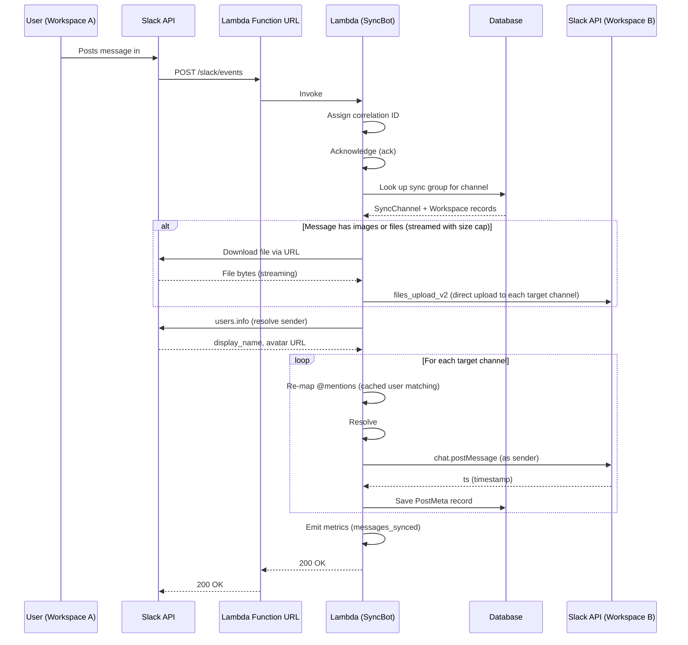
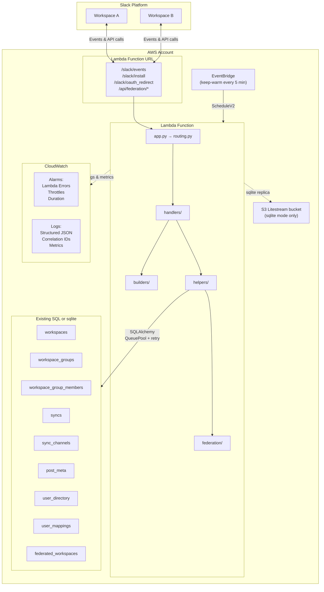
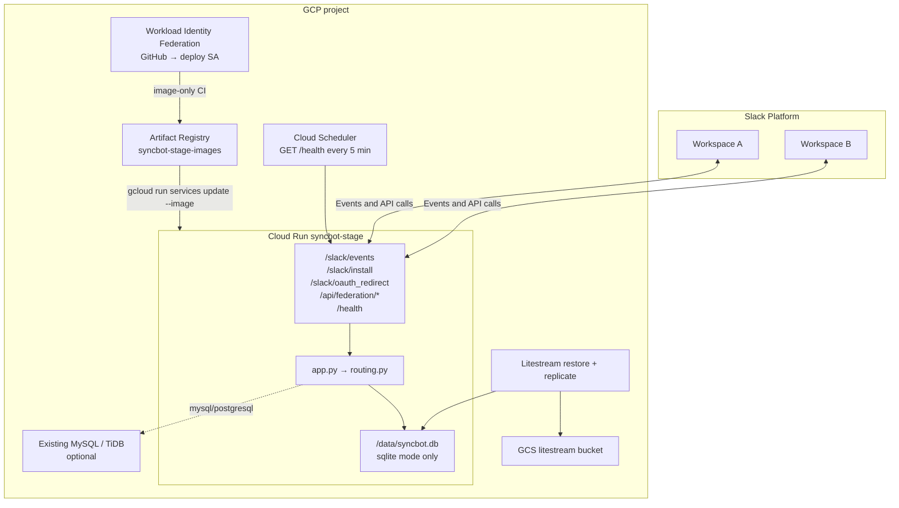

# Architecture

This page is how SyncBot is put together: the Python packages, the message-sync path, and the reference AWS and GCP layouts. For how to deploy, see [DEPLOY.md](DEPLOY.md).

## Module Overview

SyncBot is organized into six top-level packages inside `syncbot/`:

| Package | Responsibility |
|---------|----------------|
| `handlers/` | Slack event and action handlers (messages, groups, channel sync, users, tokens, federation UI, backup/restore, data migration) |
| `builders/` | Slack UI construction — Home tab, modals, and forms |
| `helpers/` | Business logic, Slack API wrappers, encryption, file handling, user matching, caching, export/import (backup dump/restore, migration build/import) |
| `federation/` | Cross-instance sync — Ed25519 signing/verification, HTTP client, API endpoint handlers, pair payload (optional team_id/workspace_name for Instance A detection) (opt-in) |
| `db/` | SQLAlchemy engine, session management, `DbManager` CRUD helper, ORM models |
| `slack/` | Block Kit abstractions — action/callback ID constants, form definitions, ORM elements |

Top-level modules: `app.py` (entry point), `routing.py` (event dispatcher), `constants.py` (env-var names), `logger.py` (structured logging + metrics).

## Message Sync Flow

When a user posts a message in a synced channel, SyncBot replicates it to every other channel in the Sync group:

The same pattern applies to edits (`chat.update`), deletes (`chat.delete`), thread replies (with `thread_ts`), and reactions (threaded reply with emoji attribution).

Slack delivers Events API payloads **at least once** (retries, queued cold starts). Message and reaction handlers claim Slack envelope ``event_id`` + ``team_id`` in ``processed_events`` before side effects: a duplicate delivery is a no-op; a failed attempt releases the claim so the retry can recover. Local fixtures that omit ``event_id`` are processed without claiming.

For **federation**, the receiving instance resolves `@` mentions and `#` channel references locally before `chat.postMessage` / `chat.update`: mapped users become native `<@U>` tags, channels that are part of the same sync become native `<#C>` tags, and other channels keep the archive links sent by the origin instance.

## AWS Infrastructure

How to deploy or update this stack (guided script, `sam`, GitHub Actions) is documented in **[DEPLOY.md](DEPLOY.md)**. The diagram below reflects the **reference** SAM template (`infra/aws/template.yaml`). The sequence diagram’s “Lambda Function URL” node is AWS-shaped; GCP uses Cloud Run with the same HTTP paths.

All of this AWS layout is defined in `infra/aws/template.yaml` (AWS SAM). **MySQL** is the default: public Lambda talks to a database you already created (TiDB Cloud, MySQL, Postgres, or RDS you own). **Sqlite** uses `/tmp/syncbot.db` plus Litestream to S3, with reserved concurrency 1. The stack does not create RDS or a VPC.

**Lambda cold start vs Slack acks:** The main function uses **256 MB** memory (faster init than 128 MB). For **mysql** / **postgresql**, Alembic runs only on `{"action":"migrate"}` (post-deploy), not on every Slack cold start. For **sqlite**, the wrapper restores from S3 and runs Alembic once per execution environment (then `litestream replicate`); a true cold start can miss Slack’s 3s window — keep-warm (`ENABLE_KEEP_WARM`) makes that rare; events still retry. EventBridge keep-warm ScheduleV2 invokes are handled in `app.handler` with a trivial JSON response instead of the Slack Bolt adapter.

## GCP Infrastructure

How to deploy this stack (guided script, Terraform, GitHub Actions) is in **[DEPLOY.md](DEPLOY.md)** and **[infra/gcp/README.md](../infra/gcp/README.md)**. The diagram matches the reference Terraform module in `infra/gcp`. The default **`database_backend` is `sqlite`**: Cloud Run scales to zero (`min_instances=0`) with a local SQLite file and a Litestream replica in GCS. **`mysql`** or **`postgresql`** is TiDB Cloud or other SQL (no GCS bucket). Cloud SQL is not created.

GitHub Actions never runs `terraform apply`. Image updates are CI-only; Terraform `lifecycle.ignore_changes` keeps the container image from being overwritten on later applies. Sqlite forces `max_instances=1` and concurrency 1. Keep-warm uses request-based billing (`cpu_idle=true`). Scale-to-zero (`min_instances=0`) relies on Slack retries; sync handlers are idempotent on `event_id`.

## Security & Hardening

| Layer | Protection |
|-------|------------|
| **Input** | File count caps (20), mention caps (50), federation user caps (5,000), federation body size limit (1 MB), `_sanitize_text` on form input |
| **Downloads** | Streaming with 30s timeout, 100 MB size cap, 8 KB chunks — prevents unbounded memory/disk usage |
| **Encryption** | Bot tokens encrypted at rest with Fernet (PBKDF2-derived key, cached to avoid repeated 600K iterations) |
| **Database** | `pool_pre_ping=True` for stale connection detection, retry decorator on all operations, `dispose()` only after all retries exhausted |
| **Slack API** | `slack_retry` decorator with exponential backoff, `Retry-After` header support, user profile caching |
| **Network** | TLS to the existing SQL host when used, Lambda Function URL (IAM `NONE` auth type), federation HMAC-SHA256 signing with 5-minute replay window |
| **Authorization** | Admin/owner checks on all configuration actions, configurable via `REQUIRE_ADMIN`. The Home tab itself opens for everyone so any user can reach **Authorize SyncBot**, which records their own Slack user token (used only to invite the bot into a private channel they belong to, never another member's token). The section lists current user permissions in plain language and reappears if a later release asks for more |

## Performance & Cost (Home and User Mapping Refresh)

To keep database and Slack API usage low when admins use the **Refresh** button on the Home tab or User Mapping screen:

- **Content hash** — A minimal set of DB queries computes a hash of the data that drives the view (groups, members, syncs, pending invites; for User Mapping, mapping ids and methods). If the hash matches the last full refresh, the app skips expensive work. The Home tab hash is per user and includes whether that person has authorized SyncBot, so the **Authorize SyncBot** section cannot be replayed from cache after they authorize.
- **Cached built blocks** — After a full refresh, the built Block Kit payload is cached (keyed by workspace and user). When the hash matches, the app re-publishes that cached view with one `views.publish` instead of re-running all DB and Slack calls.
- **60-second cooldown** — If the user clicks Refresh again within 60 seconds and the hash is unchanged, the app re-publishes the cached view with a message: "No new data. Wait __ seconds before refreshing again." (seconds remaining from the last refresh). This avoids redundant full refreshes from repeated clicks.
- **Request-scoped caching** — Within a single Lambda invocation, `get_workspace_by_id` and `get_admin_ids` use the request `context` as a cache so repeated lookups for the same workspace or admin list do not hit the DB or Slack again. The same context is passed through all "push refresh" paths (e.g. when one workspace publishes a channel and other workspaces' Home tabs are updated), so those updates share the cache and stay lightweight.

## Backup, Restore, and Data Migration

- **Full-instance backup** — Durable tables are dumped as plain JSON (no compression). Ephemeral Slack `event_id` claims (`processed_events`) are omitted. The payload includes `version`, `exported_at`, `encryption_key_hash` (SHA-256 of `DATA_ENCRYPTION_KEY`), and `hmac` (HMAC-SHA256 over canonical JSON). Restore inserts rows in FK order; it is intended for an empty or fresh database (e.g. after an AWS rebuild). On HMAC or encryption-key mismatch, the UI warns but allows proceeding. After restore, Home tab caches (`home_tab_hash`, `home_tab_blocks`) are invalidated for all restored workspaces.
- **Data migration (workspace-scoped)** — Export produces a JSON file with syncs, sync channels, post meta, user directory, and user mappings keyed by stable identifiers (team_id, sync title, channel_id). The export can include `source_instance` (webhook_url, instance_id, public_key, one-time connection code) so import on the new instance can establish the federation connection and then import in one step. The payload is signed with the instance Ed25519 key; import verifies the signature and warns (but does not block) on mismatch. Import uses replace mode: existing SyncChannels and PostMeta for that workspace in the federated group are removed, then data from the file is created. User mappings are imported where both source and target workspace exist on the new instance. After import, Home tab caches for that workspace are invalidated.
- **Instance A detection** — When instance B connects to A via federation, B can send optional `team_id` and `workspace_name` in the pair request. A stores them on the `federated_workspaces` row (`primary_team_id`, `primary_workspace_name`) and, if a local workspace with that `team_id` exists, soft-deletes it so the only representation of that workspace on A is the federated connection.
